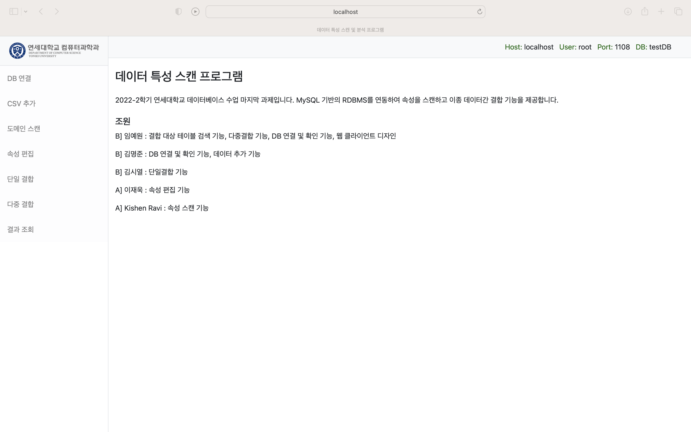
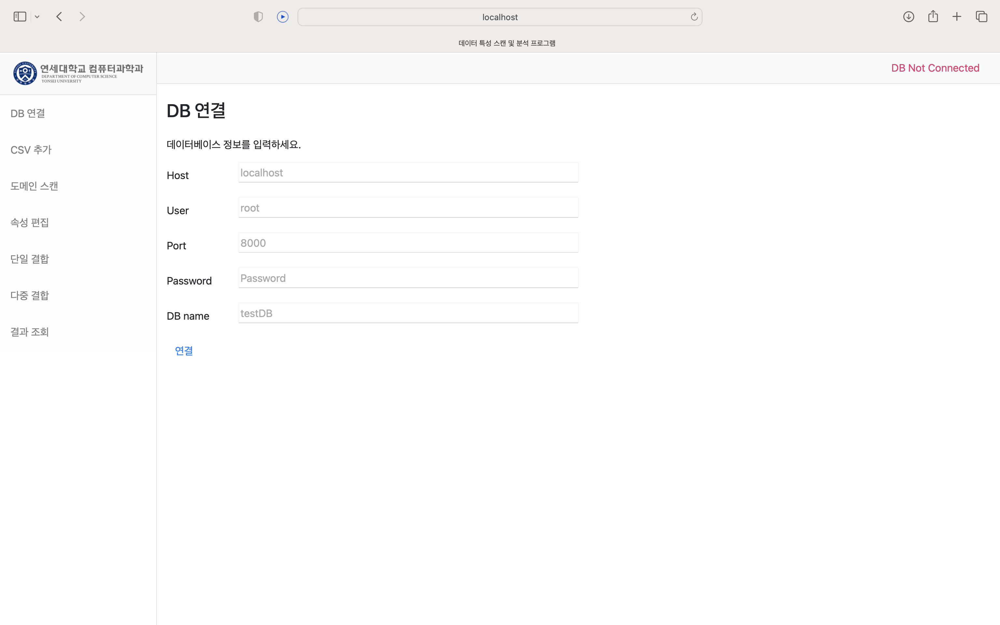
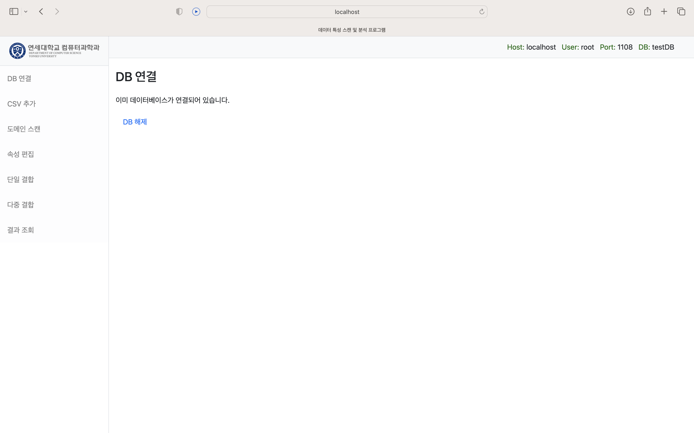
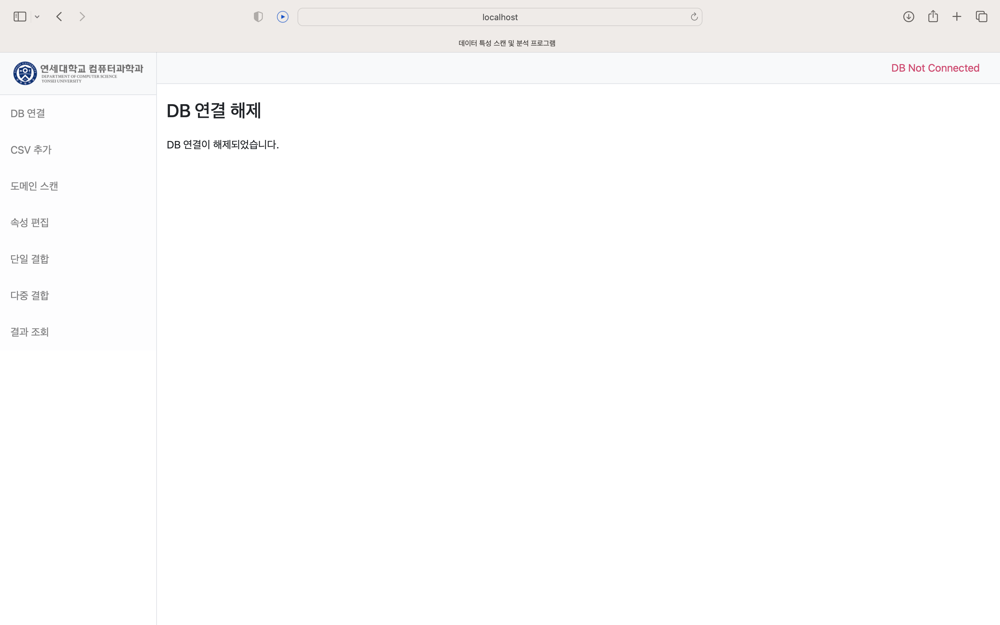
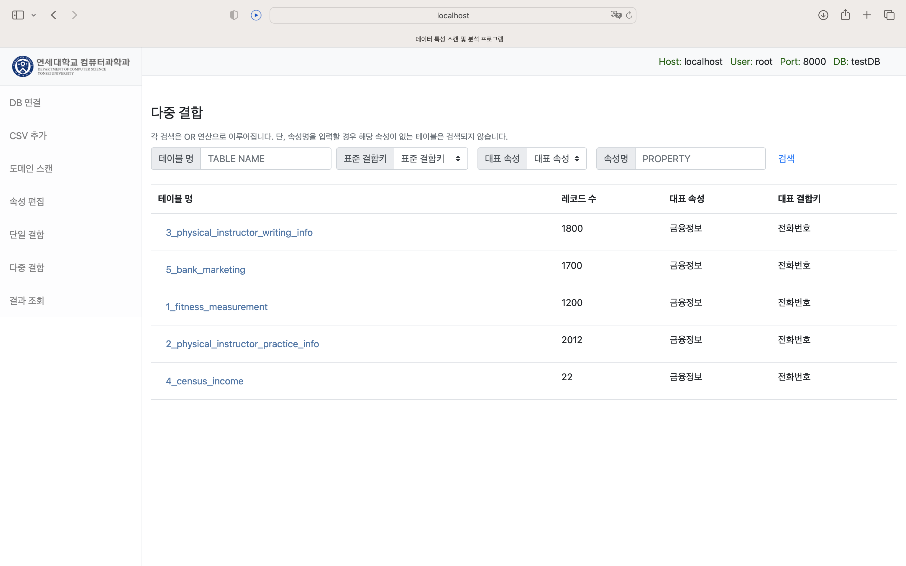
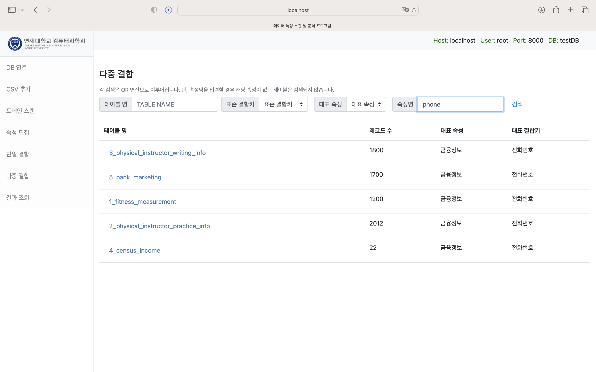
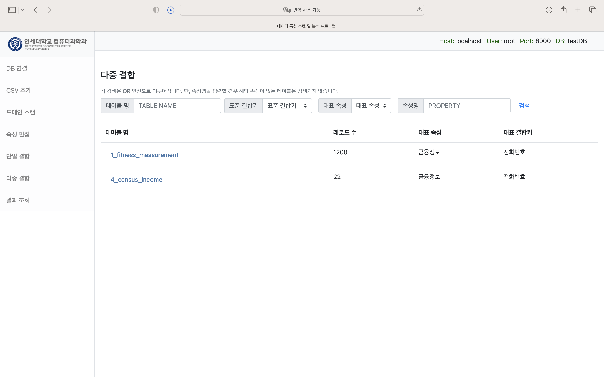
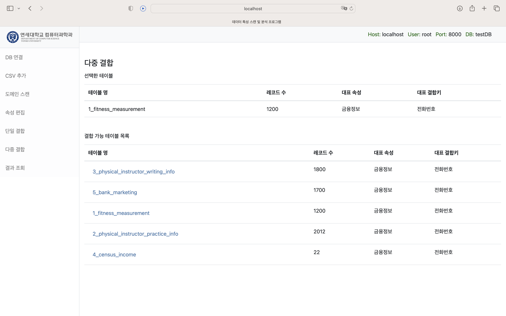

# 2022-2 연세대학교 데이터베이스 수업 FINAL PROJECT
# - 데이터 특성 스캔 프로그램


시작 및 환경설정

1. "프로젝트용 폴더 하나 생성"하고 그 위에서 git clone하기
```git clone https://github.com/mijiFernandes/db_course.git```


2. 필요한 라이브러리 설치
```pip install -r requirements.txt```


3. 마이그레이션 하기

```cd db_course```

```python manage.py migrate```     <== 아마 여기서 아래의 세션까지 다 진행됩니다.

```python manage.py migrate sessions```


4. 로컬 서버 상에서 돌리기
```python manage.py runserver```

 
 

* 메인화면 (DB 연결은 우측의 DB ON/OFF로 확인할 수 있음)




* DB 등록 화면




* DB 등록 완료




* DB 연결 해제



* DB 다중 결합 메인



* DB 다중 결합 대상 검색



* DB 다중 결합 대상 검색 결과



* DB 다중 결합 진행

